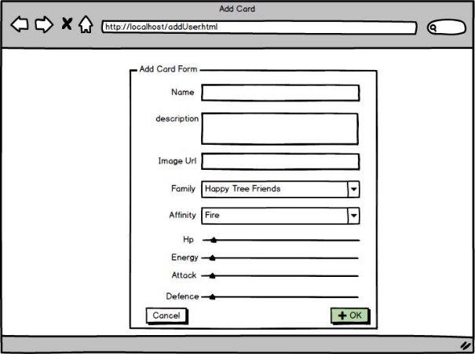
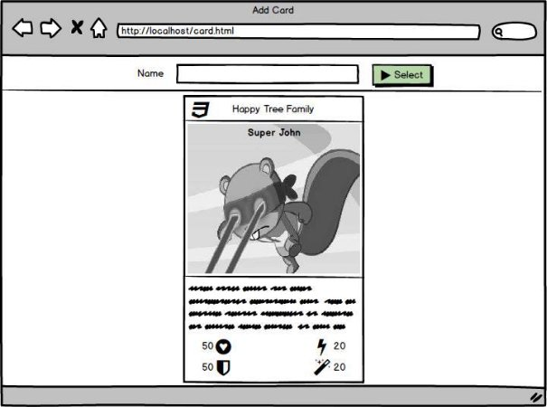

**ATELIER I -4h-**

***COMPETENCES*** 

Concepts : 

- Différence entre Web Statique + Web Services, Web Dynamique 
- Avantages/inconvénients Web Statique + Web Services, Web Dynamique 

Techno : 

- Springboot, maven, thymeleaf 
- Javascript, AJAX 

***SUJET*** 

Vous êtes en phase de création d’un projet de jeu de plateau sur une application web. En tant que responsable projet de cette application vous souhaitez explorer deux méthodes pour représenter l’IHM :  

- Utilisation de **Web Statique** en interaction avec un Web Service existant via **javascript** et **AJAX**. 
- Utilisation du **Web Dynamique** en utilisant la technologie **Springboot** et tout particulièrement les **Thymeleaf** et les **Services.** 

En s’aidant des APIs mises à votre disposition, créer **un formulaire** de saisie d’information pour la **création d’une nouvelle carte**, ainsi qu’une **page d’affichage d’une carte** en **Web Statique + Web Service** (existant).  

**FAIRE VALIDER VOTRE PRODUCTION** 

Dans un second temps, réaliser à nouveau le formulaire et l’affichage d’une carte en **Web Dynamique** en simulant des données dans le programme**.** 

**FAIRE VALIDER VOTRE PRODUCTION** 

Après avoir expliqué en quoi vos prototypes respectent le pattern **MVC**, expliquer les avantages et inconvénients des approches **Web Statique + Web Service** et **Dynamique**. 

**ATTENDU DANS LE RENDU** 

***QUESTIONS*** 

Qu’est-ce que le pattern MVC ? Quels avantages présente-t-il ? Qu’est-ce que le Web dynamique ? pourquoi est-il intéressant ? Comment sont récupérés les fichiers par le Web Browser en Web statique ? Quels sont les avantages d’utiliser du Web Statique avec des services REST ? 

Qu’est que les architectures N-Tiers ? Quelles avantages apportent-elles ? 

Comment fonction l’AJAX ? 

Qu’est-ce que JEE ? Comment fonctionne un serveur JEE ? Qu’est-ce qu’un Web Container en JEE ?  Qu’est ce que Springboot ? quelles différences avec JEE ? 

Qu’apport Thymeleaf à Springboot ?  

Que signifie l’annotation @Controller, pourquoi est-elle importante lors de la génération de pas coté serveur ?  

Que représente le répertoire ‘src/main/resources’ dans un projet SpringBoot ? Quelles sont les informations stockées à cet endroit ? 

Axe de travaux indépendants sur la recherche d’information : 

- Principe et organisation générale de JEE 
- Principe et organisation générale de Springboot 
- Principe et usage des Services dans Springboot 
- Principe et usage des templates Thymeleaf dans Springboot 
- Principe et organisation d’un projet Springboot Maven 

Axe de travaux indépendants sur la production : 

- Javascript + Ajax + Web Services 
- Template Thymeleaf 
- Projet web Springboot 

***REFERENCES  \*\*\*(indispensable)   \*\*(important) \*(optionnel)*** 

- [Javascript] AJAX : 
- **\*\*[** https://openclassrooms.com/courses/un-site-web-dynamique-avec-jquery/le- fonctionnement-de-ajax ](https://openclassrooms.com/courses/un-site-web-dynamique-avec-jquery/le-fonctionnement-de-ajax)**
- **\*\*[** https://www.w3schools.com/xml/ajax_intro.asp ](https://www.w3schools.com/xml/ajax_intro.asp)**
- [Springboot]— Moteur de template Thymeleaf 
  - \*\*[*https://www.thymeleaf.org/doc/tutorials/3.0/usingthymeleaf.html#intro ducing-thymeleaf ](https://www.thymeleaf.org/doc/tutorials/3.0/usingthymeleaf.html#introducing-thymeleaf)
  - \*[*https://www.thymeleaf.org/doc/tutorials/3.0/usingthymeleaf.html#stand ard-expression-syntax ](https://www.thymeleaf.org/doc/tutorials/3.0/usingthymeleaf.html#standard-expression-syntax)
- [Springboot-JEE] – Comparaison Springboot/JEE 
  - \*\*\*[ https://www.quora.com/What-are-the-differences-between-Java-EE-and- Spring#JVxiIA ](https://www.quora.com/What-are-the-differences-between-Java-EE-and-Spring#JVxiIA) 
- [Springboot] – Introduction 
  - \*\*\*[ https://gayerie.dev/docs/spring/spring/introduction.html ](https://gayerie.dev/docs/spring/spring/introduction.html)
- [JEE] – Doc. Officielle  
- **\*\*[ https://javaee.github.io/tutorial/overview.html ](https://javaee.github.io/tutorial/overview.html)**
- Introduction to Java EE 
- JAVA EE Application model 
- Distributed Multitiered Applications 
- Java EE Containers 
- [Java EE Application Assembly and Deployment ](https://javaee.github.io/tutorial/overview007.html#BNABX)
- Java EE APIs 

***ELEMENTS DONNES*** 

- 1 Base de données  
- 1 Web service accessible en ligne  
  - http://vps.cpe-sn.fr:8083 
- 1 Exemple d’affichage de carte à l’aide de Semantic UI (visuel html/ css + petit javascript) 
  - [https://gitlab.com/js-as1/asi1-visual-content/-/tree/master ](https://gitlab.com/js-as1/asi1-visual-content/-/tree/master)(atelier I) 
- 1 Tuto Templating en Springboot  
  - [https://gitlab.com/js-as1/asi1-springboot-tuto/-/blob/master/step1/README.md ](https://gitlab.com/js-as1/asi1-springboot-tuto/-/blob/master/step1/README.md)
- 1 sketch 

